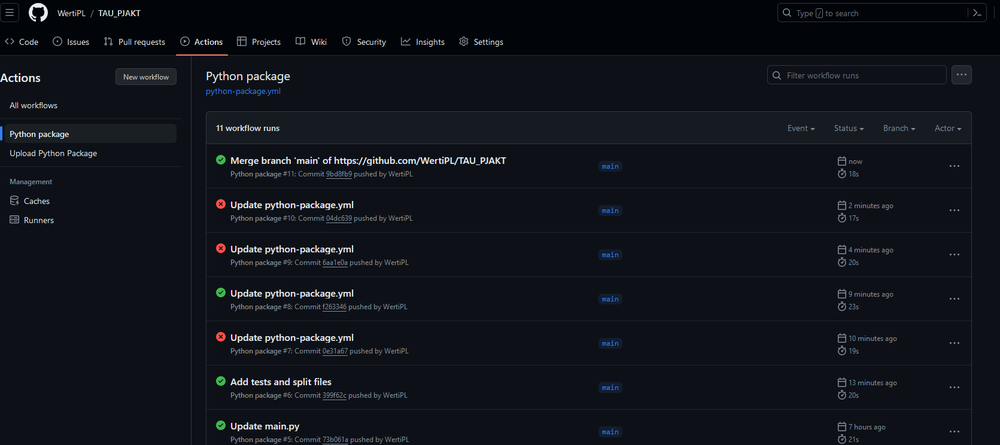
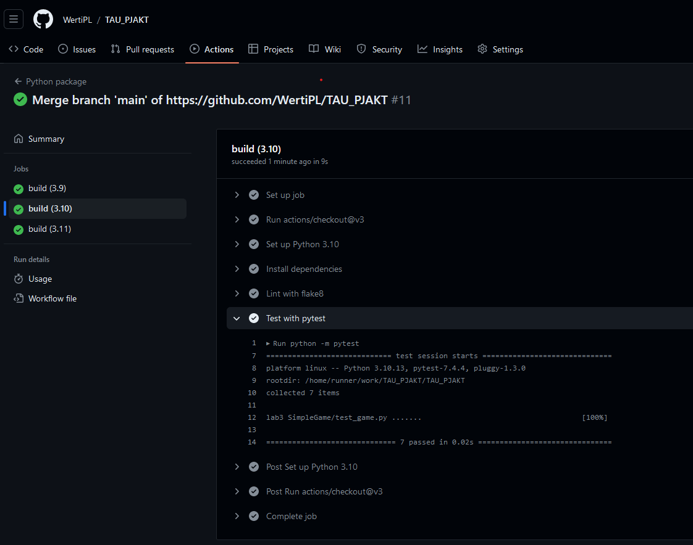

Prosta Gra w Python
Zasady gry:

    Cel gry: Osiągnij punkt końcowy (oznaczony jako "F") z punktu startowego (oznaczony jako "S"), omijając przeszkody (oznaczone jako "X").

    Ruch: Gracz może poruszać się w kierunkach: lewo, prawo, góra, dół.

    Plansza: Plansza gry jest prostokątna i zawiera start, cel, przeszkody i ścieżkę.

    Przeszkody: Przeszkody są oznaczone jako "X" i blokują ruch gracza.

Instrukcje:

    Uruchom grę, a plansza zostanie wygenerowana automatycznie.

    Plansza będzie wyświetlana w terminalu, z punktem startowym (S), punktem końcowym (F), przeszkodami (X) i ścieżką (*).

    Podaj kierunek ruchu, wpisując "left", "right", "up" lub "down" i naciśnij Enter.

    Gracz porusza się na planszy, a ruchy są aktualizowane na bieżąco.

    Gra kończy się, gdy gracz osiągnie cel, a plansza zostanie zapisana do pliku "board.txt".

Lista z workflow Github Actions

Szczegóły z workflow Github Actions

